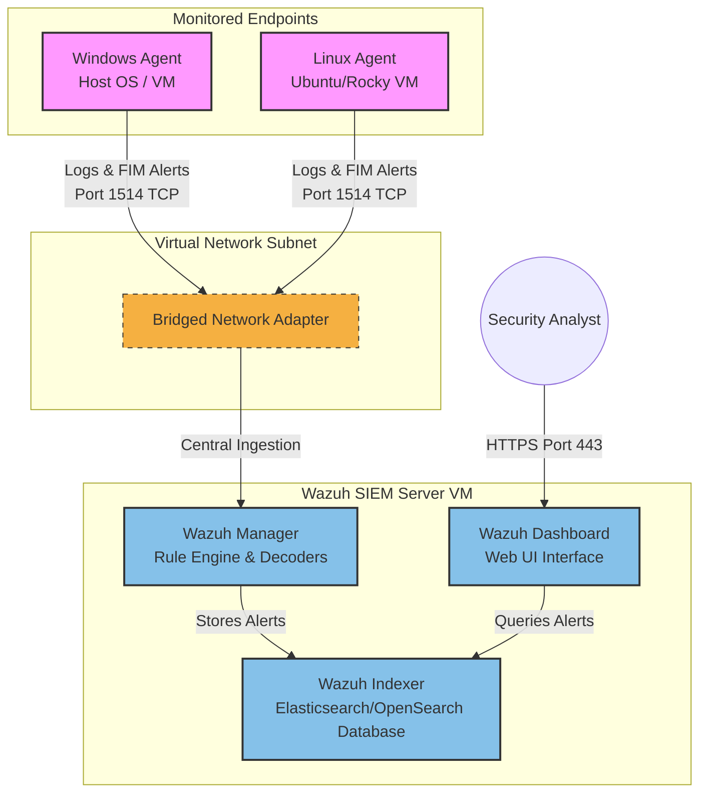

# 🛡️ Wazuh SIEM Deployment & File Integrity Monitoring (FIM) Setup

This repository contains the automation scripts, configurations, and step-by-step documentation for deploying and configuring **Wazuh SIEM** to create a centralized security monitoring environment. 

This project was completed as part of the **Week 1 Internship Task** for the **ITSimplera Solutions Cybersecurity & Infrastructure Internship Program**.

---

## 📋 Table of Contents
1. [Objective](#-objective)
2. [Architectural Overview](#%EF%B8%8F-architectural-overview)
3. [Environment & Software Specifications](#-environment--software-specifications)
4. [Step-by-Step Deployment Guide](#-step-by-step-deployment-guide)
   - [Step 1: Deploying the Wazuh Server (OVA)](#step-1-deploying-the-wazuh-server-ova)
   - [Step 2: Enrolling the Windows Agent](#step-2-enrolling-the-windows-agent)
   - [Step 3: Enrolling the Linux Agent](#step-3-enrolling-the-linux-agent)
5. [File Integrity Monitoring (FIM) Setup](#-file-integrity-monitoring-fim-setup)
6. [Alert Validation & Event Generation](#-alert-validation--event-generation)
   - [Windows FIM Event Verification](#windows-fim-event-verification)
   - [Linux FIM Event Verification](#linux-fim-event-verification)
7. [Wazuh FIM Alert Breakdown](#-wazuh-fim-alert-breakdown)
8. [Conclusion & Key Learnings](#-conclusion--key-learnings)

---

## 🎯 Objective
To establish a centralized security monitoring solution using the **Wazuh SIEM** platform. The deployment includes:
* Setting up the central Wazuh Manager inside Oracle VirtualBox.
* Enrolling both Windows and Linux endpoints as monitored agents.
* Configuring **File Integrity Monitoring (FIM)** in real-time with diff reporting (`report_changes`).
* Validating threat detection and log analysis by simulating file manipulation attacks.

---

## 🗺️ Architectural Overview

The diagram below illustrates the flow of logs, configuration parameters, and alert triggers within the deployment:



---

## 💻 Environment & Software Specifications

* **Hypervisor:** Oracle VM VirtualBox (v7.x)
* **Wazuh Manager:** Wazuh Virtual Appliance OVA (v4.8.0), preloaded with Linux (CentOS/Rocky alternative kernel).
  * *Resources:* 4 vCPUs, 8 GB RAM, 50 GB Storage.
  * *Network:* Bridged Adapter (ensuring a unique LAN IP for agent discovery).
* **Endpoints:**
  * **Windows Endpoint:** Windows 10/11 Host or VM.
  * **Linux Endpoint:** Ubuntu 22.04 LTS or similar VM.

---

## 🚀 Step-by-Step Deployment Guide

### Step 1: Deploying the Wazuh Server (OVA)
1. Download the official pre-configured virtual appliance from the [Wazuh Virtual Machine documentation](https://documentation.wazuh.com/current/deployment-options/virtual-machine/virtual-machine.html).
2. Import the `.ova` file into **VirtualBox** (`File` -> `Import Appliance`).
3. **Important:** Change the network adapter type from NAT to **Bridged Adapter** to make the server accessible across your local network.
4. Start the VM. Log in using the default credentials (`root` / `wazuh` or as configured in the setup screen).
5. Retrieve the server IP address by running:
   ```bash
   ip a
   ```
6. Open a web browser on your host machine and log in to the Wazuh Web UI:
   * **URL:** `https://<YOUR_WAZUH_SERVER_IP>`
   * **Credentials:** Default admin credentials (usually `admin` / `admin` or generated during setup).

### Step 2: Enrolling the Windows Agent
To automate the Windows Agent enrollment, we created a PowerShell installer script.

1. Open PowerShell as **Administrator**.
2. Run the deployment script:
   ```powershell
   Set-ExecutionPolicy Bypass -Scope Process -Force
   .\scripts\install-agent.ps1 -ManagerIP "<YOUR_WAZUH_SERVER_IP>"
   ```
3. This script will automatically download the Windows agent MSI, configure the manager IP, inject the FIM configuration, and start the `Wazuh` Windows service.

### Step 3: Enrolling the Linux Agent
To automate the Linux Agent enrollment:

1. Copy the `./scripts/install-agent.sh` script to your Linux VM.
2. Run it with root privileges:
   ```bash
   chmod +x install-agent.sh
   sudo ./install-agent.sh "<YOUR_WAZUH_SERVER_IP>"
   ```
3. The script configures repositories, installs the `wazuh-agent`, modifies `/var/ossec/etc/ossec.conf` to monitor `/var/wazuh-fim-test`, and restarts the agent service.

---

## 🔍 File Integrity Monitoring (FIM) Setup

Wazuh's File Integrity Monitoring (FIM) is configured inside `ossec.conf` on the agents within the `<syscheck>` block.

Our scripts automatically deploy the following configurations:

### Windows Agent (`C:\Program Files (x86)\ossec-agent\ossec.conf`):
```xml
<syscheck>
  <directories realtime="yes" report_changes="yes" check_all="yes">C:\wazuh-fim-test</directories>
</syscheck>
```

### Linux Agent (`/var/ossec/etc/ossec.conf`):
```xml
<syscheck>
  <directories realtime="yes" report_changes="yes" check_all="yes">/var/wazuh-fim-test</directories>
</syscheck>
```

### Key Configuration Directives:
* **`realtime="yes"`**: Configures instant monitoring via kernel space hooks (`inotify` for Linux, `ReadDirectoryChangesW` for Windows) instead of relying on periodic scheduled scans.
* **`report_changes="yes"`**: Configures Wazuh to record exact file content differences (diffs) and send them to the manager, allowing security analysts to inspect exactly what text was changed.
* **`check_all="yes"`**: Checks file size, permissions, owner, group, modifications, and cryptographic hashes (MD5, SHA1, SHA256) for complete integrity tracking.

---

## 🧪 Alert Validation & Event Generation

To test our FIM setup, we run automated validation scripts that simulate malicious or unauthorized file tampering.

### Windows FIM Event Verification
Run the following script to generate addition, modification, and deletion events:
```powershell
.\scripts\fim-test.ps1
```
* **Expected Output:** Creation, modification, and deletion of `C:\wazuh-fim-test\intern_report.txt` will trigger corresponding alerts on the dashboard.

### Linux FIM Event Verification
Run the following script on your Linux machine:
```bash
sudo chmod +x ./scripts/fim-test.sh
sudo ./scripts/fim-test.sh
```
* **Expected Output:** File events inside `/var/wazuh-fim-test` will trigger corresponding alerts.

---

## 🚨 Wazuh FIM Alert Breakdown

When you check your **Wazuh Dashboard** under **Security Events** or **File Integrity Monitoring**, search for the following FIM-specific rules (these are Wazuh's default built-in `syscheck` rule IDs, not custom to this deployment):

1. **Rule 554 (File Added):** Triggered when `intern_report.txt` was first created.
2. **Rule 550 (File Modified):** Triggered when the script appended a string to `intern_report.txt`. Clicking on this alert inside the dashboard will show a **diff block** highlighting the lines added.
3. **Rule 553 (File Deleted):** Triggered when the script deleted the file at the end of the test.

*Note: Make sure to take screenshots of these alerts in your Wazuh Dashboard for your submission report!*

---

## 🏁 Conclusion & Key Learnings

By completing this deployment, we successfully:
1. Configured and administered a **centralized SIEM infrastructure** on a virtualized environment.
2. Understood agent-to-manager secure communications (using cryptographic keys over ports 1514 and 1515).
3. Configured **FIM policies** to monitor sensitive system assets in real-time.
4. Demonstrated how **security event validation** is performed to verify alert thresholds and active monitoring configurations in a Security Operations Center (SOC).
